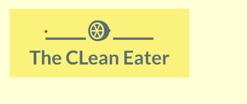
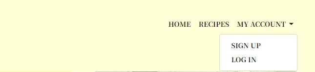
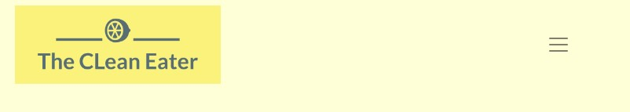
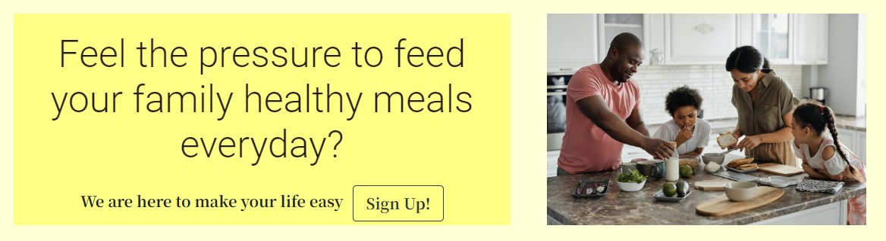
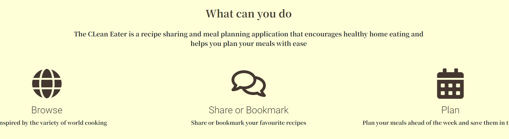

The CLean Eater is a recipe sharing and meal planning app built using the Django Framework in python.

The app provides a platform for the users to browse through multiple available recipes, share their own recipes and create a meal plan for the week; encouraging users to eat healthy home cooked meals without the stress of having to plan daily.

Here is a link to the live project [The CLean Eater]()

## Table of Contents

* [User Experience (UX)](#User-Experience-(UX))  
  * [User Stories](#User-Stories)  
* [Design](#Design)  
  * [Colour Scheme](#Colour-Scheme)  
  * [Imagery](#Imagery)  
  * [Wireframes](#Wireframes)  
  * [Database Schema](#Database-Schema)  
* [Features](#Features)  
  * [Home page](#Home-Page)  
  * [Account page](#Account-page)  
  * [Recipes page](#Recipes-page)  
  * [Recipe detail page](#Recipe-detail-page)  
  * [Add Recipe Form](#add-recipe-form)  
  * [Update Recipe Form](#update-recipe-form)  
  * [Delete Recipe](#delete-recipe)  
  * [My Meal Plan](#my-meal-plan)  
  * [My Recipes Page](#my-recipes-page)  
  * [My Bookmarks Page](#my-bookmarks-page)  
  * [Error Pages](#error-pages)  
* [Technologies](#Technologies)  
  * [Languages used](#Languages-used)  
  * [Frameworks and Libraries](#Frameworks-and-Libraries)  
* [Testing](#Testing)  
* [Deployment](#Deployment)  
  * [Github pages](#Github-pages)  
  * [Django and Heroku](#Django-and-Heroku)  
  * [Forking](#Forking)  
  * [Clone](#Clone)  
* [Credits and Acknowledgements](#Credits-and-Acknowledgements)  

## User Experience (UX)  

A visitor to Clean Eater would be someone who likes to share and lookup new recipes. Also someone who wants to eat home cooked meals and likes to plan their week ahead of time.  

### User Stories  

#### EPIC | Navigation  
- As a User I can immediately understand the website's purpose so that I know if it's what I'm looking for.
- As a User I can navigate around the site so that I can easily view desired content.  
- As a User I can view a list of recipes so that I can choose one to read.  
- As a User I can click on a recipe so that I can read the recipe details.  
- As a User I can search recipes so that I can find specific recipes I'm looking for.  

#### EPIC | User Account  
- As a User I can register for an account so that I can begin to use the services afforded to members.  
- As a User I can log in/out so that I can like recipes, comment on recipes and manage my recipes.  
- As a User I can see my login status so that I know if I'm logged in or out.  

#### EPIC | Manage Recipes  
- As a User, I can input my favourite recipes onto the app through an easy to use interface so that I can share them with other users.  
- As a User, I can edit and delete recipes that I have created so that I can easily make changes without having to start over.  
- As a User I can view my recipes so that I can see and manage all recipes I have created in the one location.  
- As a User I can view my bookmarked recipes so I can find them easily in the one location.  

#### EPIC | Manage Meal Plan    
- As a User, I can add/delete recipes to my meal planner for a particular day of the week so that I can create a meal plan for the week ahead.  
- As a User, I can view my meal plan for the week when I log into my account so that I can plan for the week ahead.  

#### EPIC | Admin  
- As a Site Administrator, I can create, read, update and delete recipes, comments and meal plan items so that I can manage the app content.  

## Design  

### Colour Scheme  

I wanted to keep the colour scheme friendly and inviting hence I choose the colour scheme around yellow and earthy tones.  
Contrast between background and foreground colours is implemented to maintain clear visibility.  

  

### Imagery  

All of the current imagery on the website has been taken from Pelex.  
The home page displays a family that's cooking together to portray the idea that cooking too can be fun.  
Images of the dish will be unloaded by individual website users when they upload a new recipe they would like to share.  

### Wireframes  

### Database Schema  

I used principles of Object-Oriented Programming throughout this project and Django’s Class-Based Generic Views.  
Django AllAuth was used for the user authentication system.  
In order for the users to create recipes a custom recipe model was required. The recipe author is a foreign key to the User model given a recipe can only have one author.  
The Comment model allows users to comment on individual recipes and the Recipe is a foreign key in the comment model given a comment can only be linked to one recipe.  
The meal plan item model allows users to add recipes to a meal plan for a particular day. A meal plan item can only have one user and one recipe and is therefore linked to the User and Recipe models through foreign keys.  
  
  
  
## Features  
  
### Home page  
  
- A customised logo was created using Hatchful by Shopify which is a free logo generator.  
- This logo is positioned in the top left of the navigation bar. The logo is linked to the home page for ease of navigation for the user.  

  
  
- The navigation bar is present at the top of every page and includes all links to the various other pages.  
- The My Account navigation link is a drop down menu which includes the Sign up and Log in links.   
- When the user has logged in, the My Account drop down menu changes to display the user's name.  

  
- The home page includes a call to action section which encourages the user to sign up to the site.  
- If a user is already signed in the message changes to 'Welcome back CLean eater'.  
- The sign up button changes to a 'Create' button which takes the user to the 'Add recipe' page.  

  
 - The 'What can you do' section gives a overview of what the site has to offer and summarizes the features with font awesome icons.  

 
  
## Technologies  
  
### Languages used  
  
[HTML5](https://en.wikipedia.org/wiki/HTML5)  
[CSS3](https://en.wikipedia.org/wiki/Cascading_Style_Sheets)  
[Javascript](https://en.wikipedia.org/wiki/JavaScript)  
[Python](https://www.python.org/)  
  
### Frameworks and Libraries  
  
[Django](https://www.djangoproject.com/): Main python framework used in the development of this project.  
[Django-allauth](https://django-allauth.readthedocs.io/en/latest/installation.html): authentication library used to create the user accounts.  
[PostgreSQL](https://www.postgresql.org/) was used as the database for this project.  
[Heroku](https://dashboard.heroku.com/login) - was used as the cloud based platform to deploy the site on.  
[Chrome Dev Tools](https://developer.chrome.com/docs/devtools/) - Used for overall development and tweaking, including testing responsiveness and performance.
[Font Awesome](https://fontawesome.com/) - Used for icons in information bar.  
[GitHub](https://github.com/) - Used for version control and agile tool.  
[Google Fonts](https://fonts.google.com/) - Used to import and alter fonts on the page.  
[W3C](https://www.w3.org/) - Used for HTML & CSS Validation.  
[PEP8 Online](http://pep8online.com/) - used to validate all the Python code.  
[Jshint](https://jshint.com/) - used to validate javascript.  
[Coolors](https://coolors.co/) - Used to create colour palette.  
[Lucidchart](https://lucid.app/documents#/dashboard) - used to create the database schema design.  
[Summernote](https://summernote.org/): A WYSIWYG editor to allow users to edit their posts.  
[Techsini](https://techsini.com/multi-mockup/index.php) - Site mockup generator.  
[Crispy Forms](https://django-crispy-forms.readthedocs.io/en/latest/) used to manage Django Forms.  
[Cloudinary](https://cloudinary.com/): the image hosting service used to upload images  
[Bootstrap 4.6](https://getbootstrap.com/docs/4.6/getting-started/introduction/): CSS Framework for developing responsiveness and styling.  
  
## Testing  
  
## Deployment  
  
### Github pages  
  
To create a new repository I took the following steps:  

    1. Logged into Github.  
    2. Clicked over to the ‘repositories’ section.  
    3. Clicked the green ‘new’ button. This takes you to the create new repository page.  
    4. Once there under ‘repository template’ I chose the code institute template from the dropdown menu.  
    5. I input a repository name then clicked the green ‘create repository button’ at the bottom of the page.  
    6. Once created I opened the new repository and clicked the green ‘Gitpod’ button to create a workspace in Gitpod for editing.  

### Django and Heroku  
  
To get the Django framework installed and set up I followed the Code institutes [Django Blog cheatsheet](https://codeinstitute.s3.amazonaws.com/fst/Django%20Blog%20Cheat%20Sheet%20v1.pdf).  

### Forking  
  
To fork my project you must:  
    1. Sign in to Github and go to my [repository](https://github.com/Pradnya144/Portfolio-Project-4)  
    2. Locate the Fork button at the top right of the page.  
    3. Select this.   
    4. The fork is now in your repositories.  
    
### Clone  

To clone my project you must:  
  1. Sign in to Github and go to my [repository](https://github.com/Pradnya144/Portfolio-Project-4)   
    2. Above the list of files click the green ‘code’ button.  
    3. This will bring up a few options as to how you would like to clone. You can select HTTPS, SSH or Github CLI, then click the clipboard icon to copy the URL.  
    4. Open git bash  
    5. Type ‘git clone’ and then paste the URL you copied. Press Enter.  

    For more information on cloning check out the github documentation https://docs.github.com/en/repositories/creating-and-managing-repositories/cloning-a-repository  

## Credits and Acknowledgements  

-The inspiration to this website comes from a mobile app called KptnCook.  
- [W3Schools](https://www.w3schools.com/)  
- [Django Docs](https://docs.djangoproject.com/en/4.0/)  
- [Bootstrap 4.6 Docs](https://getbootstrap.com/docs/4.6/getting-started/introduction/)  
- [Stack Overflow](https://stackoverflow.com/)  
- [Pexels](https://www.pexels.com/)  
- [Update View](https://pytutorial.com/django-updateview-example)  
- [Pagination](https://docs.djangoproject.com/en/2.2/topics/pagination/#using-paginator-in-a-view)  
- [Code Institute - I Think before I Blog Walkthrough Project](https://github.com/Code-Institute-Solutions/Django3blog)  
- [] : Recipe content was sourced from.  
